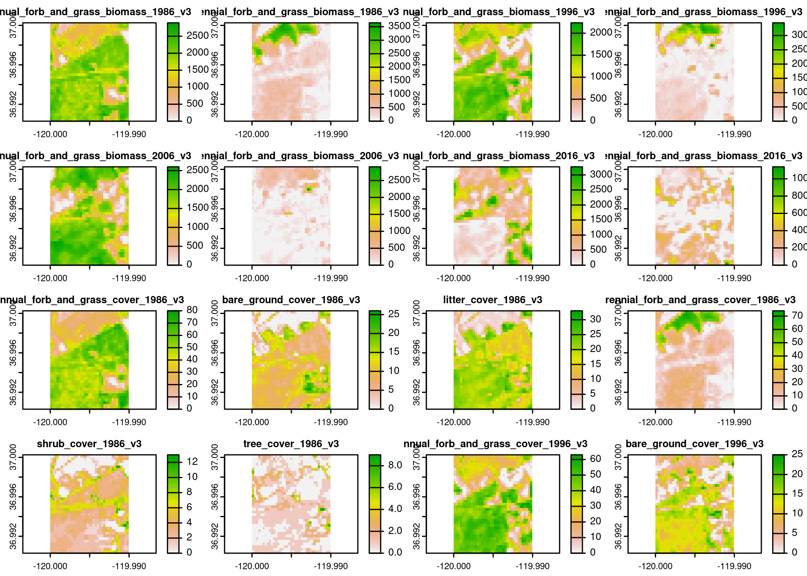

<!-- README.md is generated from README.Rmd. Please edit that file -->

# rapr

<!-- badges: start -->

[](https://github.com/brownag/rapr/actions)
[](https://codecov.io/gh/brownag/rapr?branch=main)
[](https://humus.rocks/rapr/)
<!-- badges: end -->

The goal of {rapr} is to provide a simple R interface to Rangeland
Analysis Platform (RAP) Vegetation Biomass and Cover Products. See
<https://rangelands.app/products> and `citation("rapr")` for more
information on these products.

You can query annual biomass and cover (versions 2 and 3) for the years
1986 to present.

-   `product = "vegetation-biomass"` returns two layers for each year:

    -   `"annual forb and grass"`, `"perennial forb and grass"` (**lbs /
        acre**).

-   `product = "vegetation-cover"` returns six layers for each year:

    -   `"annual forb and grass"`, `"bare ground"`, `"litter"`,
        `"perennial forb and grass"`, `"shrub"`, `"tree"` (**% cover**)

## Installation

You can install the development version of {rapr} from
[GitHub](https://github.com/brownag/rapr) with:

``` r
# install.packages("remotes")
remotes::install_github("brownag/rapr")
```

## Example

This example shows how to use a
{[terra](https://github.com/rspatial/terra)} SpatVector containing a
rectangular polygon with `rapr::get_rap()` to obtain RAP grids for the
corresponding extent.

{[terra](https://cran.r-project.org/package=terra)},
{[raster](https://cran.r-project.org/package=raster)},
{[sf](https://cran.r-project.org/package=sf)} and
{[sp](https://cran.r-project.org/package=sp)} objects are all supported
input types. Any spatial object used should have its Coordinate
Reference System defined, as the input coordinates will be projected to
the source data Coordinate Reference System of the RAP grids (WGS84
decimal degrees / `"EPSG:4326"`).

``` r
library(terra)
#> terra 1.5.23
library(rapr)

res <- get_rap(
  vect("POLYGON ((-120 36.99,-119.99 37,-120 37,-120 36.99))",
       crs = "EPSG:4326"), 
  version = "v3",
  year = c(1986, 1996, 2006, 2016),
  progress = FALSE
)

res
#> class       : SpatRaster 
#> dimensions  : 37, 37, 32  (nrow, ncol, nlyr)
#> resolution  : 0.0002694946, 0.0002694946  (x, y)
#> extent      : -120, -119.99, 36.99029, 37.00026  (xmin, xmax, ymin, ymax)
#> coord. ref. : lon/lat WGS 84 (EPSG:4326) 
#> sources     : 1986vegetation-biomassv3_7b575bb6cea7.tif  (2 layers) 
#>               1996vegetation-biomassv3_7b5711fff153.tif  (2 layers) 
#>               2006vegetation-biomassv3_7b575a764c95.tif  (2 layers) 
#>               ... and 5 more source(s)
#> names       : annua~86_v3, peren~86_v3, annua~96_v3, peren~96_v3, annua~06_v3, peren~06_v3, ...

plot(res)
```



When a `filename` argument is not specified, unique temporary files will
be generated. The resulting SpatRaster object will retain reference to
these files, and you can remove them manually with
`unlink(terra::sources(<SpatRaster>))`.

When a `filename` *is* specified, temporary files will be removed after
the result (often a multi- year/layer/product) SpatRaster is written to
new file.

In lieu of a spatial object from {terra}, {raster}, {sf} or {sp}
packages you may specify a bounding box using a numeric vector
containing `xmin`, `ymax`, `xmax`, `ymin` in WGS84 longitude/latitude
decimal degrees (corresponding to order used in `gdal_translate`
`-projwin` option).
e.g. `get_rap(x = c(-120, 37, -119.99, 36.99), ...)`.

    (1: xmin, 2: ymax)--------------------------|
            |                                   |
            |         TARGET EXTENT             |
            |  x = c(xmin, ymax, xmax, ymin)    |
            |                                   |
            |---------------------------(3: xmax, 4: ymin)

## Citation

    #> 
    #> To cite rapr in publications use:
    #> 
    #>   Andrew Brown (2022). rapr: Interface to Rangeland Analysis Platform
    #>   (RAP) Vegetation Biomass and Cover Products. R package version 0.1.0.
    #>   http://github.com/brownag/rapr
    #> 
    #>   Jones, M.O., N.P. Robinson, D.E. Naugle, J.D. Maestas, M.C. Reeves,
    #>   R.W. Lankston, and B.W. Allred. 2021. Annual and 16-Day Rangeland
    #>   Production Estimates for the Western United States. Rangeland Ecology
    #>   & Management 77:112-117. http://dx.doi.org/10.1016/j.rama.2021.04.003
    #> 
    #>   Robinson, N. P., M. O. Jones, A. Moreno, T. A. Erickson, D. E.
    #>   Naugle, and B. W. Allred. 2019. Rangeland productivity partitioned to
    #>   sub-pixel plant functional types. Remote Sensing 11:1427.
    #>   http://dx.doi.org/10.3390/rs11121427
    #> 
    #>   Allred, B. W., B. T. Bestelmeyer, C. S. Boyd, C. Brown, K. W. Davies,
    #>   L. M. Ellsworth, T. A. Erickson, S. D. Fuhlendorf, T. V. Griffiths,
    #>   V. Jansen, M. O. Jones, J. Karl, J. D. Maestas, J. J. Maynard, S. E.
    #>   McCord, D. E. Naugle, H. D. Starns, D. Twidwell, and D. R. Uden.
    #>   2021. Improving Landsat predictions of rangeland fractional cover
    #>   with multitask learning and uncertainty. Methods in Ecology and
    #>   Evolution. http://dx.doi.org/10.1111/2041-210x.13564
    #> 
    #> To see these entries in BibTeX format, use 'print(<citation>,
    #> bibtex=TRUE)', 'toBibtex(.)', or set
    #> 'options(citation.bibtex.max=999)'.
