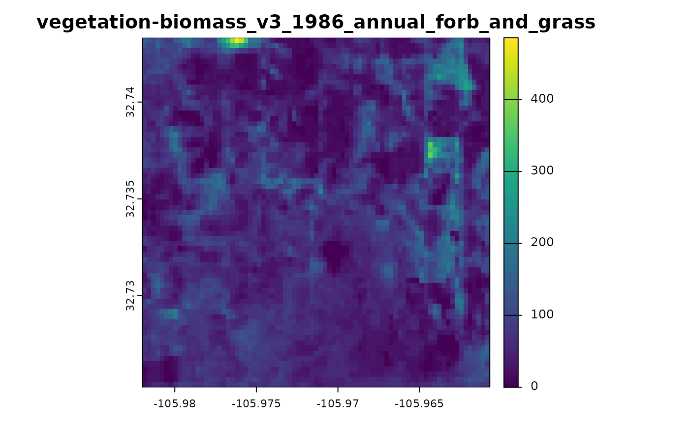

# Accessing 'Rangeland Analysis Platform' (RAP) Products with R

``` r
library(rapr)    # access RAP products
library(terra)   # spatial data handling
```

    ## terra 1.8.93

First, we buffer 1000 meters around a longitude/latitude coordinate
(WGS84 decimal degrees) using the {terra} package.

Change the buffering distance to include different extents around a
point.

``` r
p <- buffer(terra::vect(
  data.frame(x = -105.97133, y = 32.73437),
  geom = c("x", "y"),
  crs = "OGC:CRS84"
), width = 1000)
```

You can change the coordinates your favorite range spot!

We can interactively inspect the area of interest, for example using
[`terra::plet()`](https://rspatial.github.io/terra/reference/plet.html)
{leaflet} map:

``` r
terra::plet(p, tiles = c("Esri.WorldImagery", "OpenTopoMap"))
```

Then we use {rapr} to download the ‘Rangeland Analysis Platform’
“vegetation-biomass” product for 1986 to 2024 using the polygon `p` to
define the area of interest.

``` r
rap <- get_rap(
  p,
  product = "vegetation-biomass",
  years = 1986:2024,
  verbose = FALSE
)
```

Once that’s done, let’s look at the first layer:

``` r
plot(rap[[1]], main = names(rap)[1])
```



## Animated Plots

Now we will select just the `"annual forb and grass biomass"` layers,
iterate over them, and plot. We are symbolizing with a common range of
`[0,500]` pounds per acre so the color scheme is consistent from year to
year. We write this iteration into a function called `makeplot()` and
use {gifski} to render an animated GIF file from the R plot graphics
output in each year for a total of 39 layers.

``` r
makeplot <- function() {
  lapply(grep("annual_forb_and_grass", names(rap)), function(i) {
    terra::plot(
      rap[[i]],
      main = names(rap)[i],
      type = "continuous",
      range = c(0, 500),
      cex.main = TRUE
    )
    terra::plot(
      terra::as.lines(p),
      col = "white",
      add = TRUE
    )
  })
}
```

Using the {gifski} package
[`save_gif()`](https://r-rust.r-universe.dev/gifski/reference/gifski.html)
function we can easily create an animated graphic of the RAP
predictions:

``` r
try({
  
library(gifski) 
gifski::save_gif(makeplot(), 
                 gif_file = "annual_forb_and_grass_biomass.gif", 
                 delay = 0.5)

})
```

    ## [1] "annual_forb_and_grass_biomass.gif"


