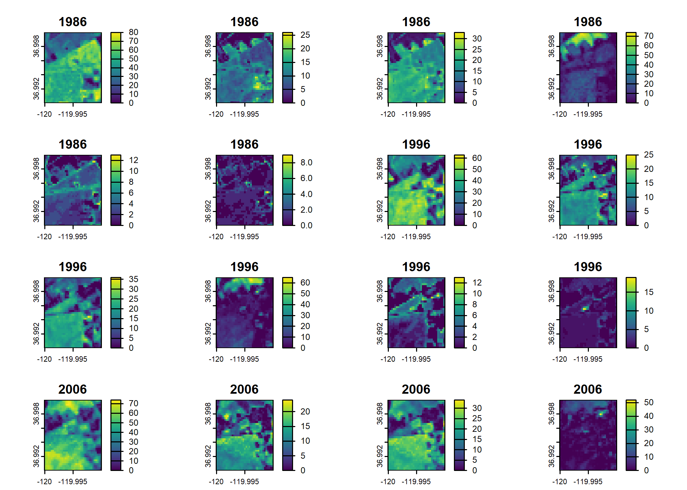

# rapr

The goal of {rapr} is to provide a simple **R** interface to ‘Rangeland
Analysis Platform’ (RAP) products. See <https://rangelands.app/products>
and `citation("rapr")` for more information.

## Installation

You can install {rapr} from CRAN:

``` r
install.packages("rapr")
```

You can install the development version of {rapr} from
[GitHub](https://github.com/brownag/rapr) with:

``` r
# install.packages("remotes")
remotes::install_github("brownag/rapr")
```

## Sources, Products, and Band Information

Two sets of gridded RAP products are available (see
[`get_rap()`](https://humus.rocks/rapr/reference/get_rap.md) `source`
argument). Also, you can access the API endpoint for the 16-day
production tabular data (see
[`get_rap_production16day_table()`](https://humus.rocks/rapr/reference/get_rap_production16day_table.md)).

- `"rap-30m"` is Landsat-derived and has approximately 30 meter
  resolution in WGS84 decimal degrees (`"EPSG:4326"`). This is the data
  source that has been used in the ‘rapr’ package since 2022.

- `"rap-10m"` is Sentinel 2-derived and has 10 meter resolution in the
  local WGS84 UTM zone (`"EPSG:326XX"`, where XX is the two digit UTM
  zone number). It is a newer (2025) data source.

For `"rap-30m"` you can query several Landsat derived annual biomass,
cover, and Net Primary Productivity products from 1986 to present:

- `product = "vegetation-biomass"` returns [two
  layers](http://rangeland.ntsg.umt.edu/data/rap/rap-vegetation-biomass/v3/README)
  per year:

  - 2 Bands:`"annual forb and grass"`, `"perennial forb and grass"`
    (**lbs / acre**)

- `product = "vegetation-cover"` returns [six
  layers](http://rangeland.ntsg.umt.edu/data/rap/rap-vegetation-cover/v3/README)
  per year:

  - 6 Bands: `"annual forb and grass"`, `"bare ground"`, `"litter"`,
    `"perennial forb and grass"`, `"shrub"`, `"tree"` (**% cover**)

- `product = "vegetation-npp"` returns [four
  layers](http://rangeland.ntsg.umt.edu/data/rap/rap-vegetation-npp/v3/README)
  per year:

  - 4 Bands: `"annual forb and grass"`, `"perennial forb and grass"`,
    `"shrub"`, `"tree"` (NPP; kg\*C/m^2)

For `"rap-10m"` you can query several [Sentinel 2 derived cover
products](http://rangeland.ntsg.umt.edu/data/rangeland-s2/README) at 10
meter resolution from 2018 to present:

- `product = "pft"` returns fractional cover estimates of plant
  functional types:

  - 6 Bands: `"annual forb and grass"`, `"bare ground"`, `"litter"`,
    `"perennial forb and grass"`, `"shrub"`, `"tree"` (**% cover**)

- `product = "gap"` returns canopy gap estimates for four canopy gap
  size classes:

  - 4 Bands: `"Gaps 25-50 cm"`, `"Gaps 51-100 cm"`, `"Gaps 100-200 cm"`,
    `"Gaps >200 cm"` (**% cover**)

- `product = "arte"` returns cover estimates of Artemisia species,
  including A. arbuscula, A. cana, A. nova, A. tridentata, and A.
  tripartita.

  - 1 Band: `"Artemisia spp."` (**% cover**)

- `product = "iag"` returns fractional cover estimates of Bromus
  tectorum, B. arvensis, B. rubens, B. hordeaceus, Eremopyrum triticeum,
  Schismus spp., Taeniatherum caput-medusae, and Ventenata dubia.

  - 1 Band: `"invasive annual grass"` (**% cover**)

- `product = "pj"` returns fractional cover estimates of Juniperus
  monosperma, J. occidentalis, J. osteosperma, J. scopulorum, Pinus
  edulis, and P. monophylla.

  - 1 Band: `"pinyon-juniper"` (**% cover**)

## Temporary Files

Large requests may generate intermediate objects that will be stored as
temporary files. See
[`terra::tmpFiles()`](https://rspatial.github.io/terra/reference/tmpFile.html)
to view the file paths. These files will be removed when an **R**
session ends.

## Alternate Specification of Area of Interest

In lieu of a spatial object from {terra}, {raster}, {sf} or {sp}
packages you may specify a bounding box using a numeric vector
containing the top-left and bottom-right coordinates (`xmin`, `ymax`,
`xmax`, `ymin`) in WGS84 longitude/latitude decimal degrees. This
corresponds to the conventional order used in the `gdal_translate`
`-projwin` option. e.g. `get_rap(x = c(-120, 37, -119.99, 36.99), ...)`.

``` R
(1: xmin, 2: ymax)--------------------------|
        |                                   |
        |         TARGET EXTENT             |
        |  x = c(xmin, ymax, xmax, ymin)    |
        |                                   |
        |---------------------------(3: xmax, 4: ymin)
```

## Native Resolution and Projection Systems

Native cell resolution of `"rap-30m"` is approximately 30m x 30m in
WGS84 geographic coordinate system (longitude, latitude). Native cell
resolution of `"rap-10m"` is 10m x 10m in the local (projected) WGS84
Universal Transverse Mercator (UTM) system.

For `"rap-10m"` requests spanning *multiple* UTM zones, either pass a
*SpatRaster* object as `x` or specify `template` argument. In lieu of a
user-specified grid system for multi-zone requests, a default CONUS
Albers Equal Area projection (`"EPSG:5070"`) with 10 m resolution will
be used. See
[`rap_projection()`](https://humus.rocks/rapr/reference/rap_projection.md)
for options and details.

## Example

This example shows how to use a
{[terra](https://github.com/rspatial/terra)} SpatVector containing a
rectangular polygon with
[`rapr::get_rap()`](https://humus.rocks/rapr/reference/get_rap.md) to
obtain RAP grids for the corresponding extent.
{[terra](https://cran.r-project.org/package=terra)},
{[raster](https://cran.r-project.org/package=raster)},
{[sf](https://cran.r-project.org/package=sf)} and
{[sp](https://cran.r-project.org/package=sp)} objects are all supported
input types. Any spatial object used should have its Coordinate
Reference System defined, as the input coordinates will be projected to
the source data grid system.

``` r
library(terra)
#> Warning: package 'terra' was built under R version 4.5.1
#> terra 1.8.56
library(rapr)

res <- get_rap(
  vect("POLYGON ((-120 36.99,-119.99 37,-120 37,-120 36.99))",
       crs = "EPSG:4326"), 
  version = "v3",
  product = "vegetation-cover",
  years = c(1986, 1996, 2006, 2016),
  verbose = TRUE
)
#> Processing: http://rangeland.ntsg.umt.edu/data/rap/rap-vegetation-cover/v3/vegetation-cover-v3-1986.tif
#> Processing: http://rangeland.ntsg.umt.edu/data/rap/rap-vegetation-cover/v3/vegetation-cover-v3-1996.tif
#> Processing: http://rangeland.ntsg.umt.edu/data/rap/rap-vegetation-cover/v3/vegetation-cover-v3-2006.tif
#> Processing: http://rangeland.ntsg.umt.edu/data/rap/rap-vegetation-cover/v3/vegetation-cover-v3-2016.tif
#> Cropping and writing result to memory or temporary file

res
#> class       : SpatRaster 
#> size        : 37, 37, 24  (nrow, ncol, nlyr)
#> resolution  : 0.0002694946, 0.0002694946  (x, y)
#> extent      : -120, -119.99, 36.99002, 36.99999  (xmin, xmax, ymin, ymax)
#> coord. ref. : lon/lat WGS 84 (EPSG:4326) 
#> source(s)   : memory
#> names       : veget~grass, veget~round, veget~itter, veget~grass, veget~shrub, veget~_tree,     ... 
#> min values  :           0,           0,           0,           0,           0,           0,     ... 
#> max values  :          80,          26,          33,          74,          13,           9,     ... 
#> unit        : % cover 
#> time (years): 1986 to 2016 (4 steps)

plot(res)
```



In lieu of a spatial object from {terra}, {raster}, {sf} or {sp}
packages you may specify a bounding box using a numeric vector
containing `xmin`, `ymax`, `xmax`, `ymin` in WGS84 longitude/latitude
decimal degrees (corresponding to order used in `gdal_translate`
`-projwin` option).
e.g. `get_rap(x = c(-120, 37, -119.99, 36.99), ...)`.

``` R
(1: xmin, 2: ymax)--------------------------|
        |                                   |
        |         TARGET EXTENT             |
        |  x = c(xmin, ymax, xmax, ymin)    |
        |                                   |
        |---------------------------(3: xmax, 4: ymin)
```

## Citation

``` R
#> To cite rapr in publications use:
#> 
#>   Brown A (2025). _rapr: Interface to Rangeland Analysis Platform (RAP)
#>   Vegetation Biomass and Cover Products_. R package version 1.1.0,
#>   <https://CRAN.R-project.org/package=rapr>.
#> 
#>   Allred, B.W., S.E. McCord, T.J. Assal, B.T. Bestelmeyer, C.S. Boyd,
#>   A.C. Brooks, S.M. Cady, S.D. Fuhlendorf, S.A. Green, G.R. Harrison,
#>   E.R. Jensen, E.J. Kachergis, C.M. Mattilio, B.A. Mealor, D.E. Naugle,
#>   D. O'Leary, P.J. Olsoy, E.S. Peirce, J.R. Reinhardt, R.K. Shriver,
#>   J.T. Smith, J.D. Tack, A.M. Tanner, E.P. Tanner, D. Twidwell, N.P.
#>   Webb, and S.L. Morford. 2025. Estimating rangeland fractional cover
#>   and canopy gap size class with Sentinel-2 imagery. bioRxiv.
#>   https://doi.org/10.1101/2025.03.13.643073
#> 
#>   Jones, M.O., N.P. Robinson, D.E. Naugle, J.D. Maestas, M.C. Reeves,
#>   R.W. Lankston, and B.W. Allred. 2021. Annual and 16-Day Rangeland
#>   Production Estimates for the Western United States. Rangeland Ecology
#>   & Management 77:112-117. http://dx.doi.org/10.1016/j.rama.2021.04.003
#> 
#>   Allred, B. W., B. T. Bestelmeyer, C. S. Boyd, C. Brown, K. W. Davies,
#>   L. M. Ellsworth, T. A. Erickson, S. D. Fuhlendorf, T. V. Griffiths,
#>   V. Jansen, M. O. Jones, J. Karl, J. D. Maestas, J. J. Maynard, S. E.
#>   McCord, D. E. Naugle, H. D. Starns, D. Twidwell, and D. R. Uden.
#>   2021. Improving Landsat predictions of rangeland fractional cover
#>   with multitask learning and uncertainty. Methods in Ecology and
#>   Evolution. http://dx.doi.org/10.1111/2041-210x.13564
#> 
#>   Robinson, N. P., M. O. Jones, A. Moreno, T. A. Erickson, D. E.
#>   Naugle, and B. W. Allred. 2019. Rangeland productivity partitioned to
#>   sub-pixel plant functional types. Remote Sensing 11:1427.
#>   http://dx.doi.org/10.3390/rs11121427
#> 
#> To see these entries in BibTeX format, use 'print(<citation>,
#> bibtex=TRUE)', 'toBibtex(.)', or set
#> 'options(citation.bibtex.max=999)'.
```
